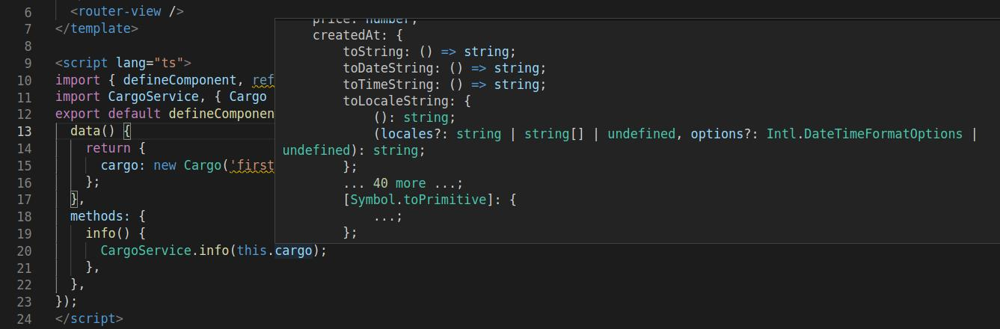

# date_error_vue_compiler

## Example

src/CargoService.ts

```typescript
interface ICargo {
  name: string;
  createdAt: Date;
  price: number;
}

export class Cargo implements ICargo {
  name: string;
  price: number;
  createdAt: Date;

  constructor(name = '', price = 0) {
    this.name = name;
    this.price = price;
    this.createdAt = new Date();
  }
}

export default class CargoService {
  static info(cargoData: Cargo): void {
    console.log(cargoData);
  }
}
```

App.vue

```typescript
<script lang="ts">
import { defineComponent, ref } from 'vue';
import CargoService, { Cargo } from './CargoService';
export default defineComponent({
  data() {
    return {
      cargo: new Cargo('first', 100),
    };
  },
  methods: {
    info() {
      CargoService.info(this.cargo);
    },
  },
});
</script>
```

### Error

```
src/App.vue:20:25
TS2345: Argument of type '{ name: string; price: number; createdAt: { toString: () => string; toDateString: () => string; toTimeString: () => string; toLocaleString: { (): string; (locales?: string | string[] | undefined, options?: DateTimeFormatOptions | undefined): string; }; ... 39 more ...; getVarDate: () => VarDate; }; }' is not assignable to parameter of type 'Cargo'.
  Types of property 'createdAt' are incompatible.
    Property '[Symbol.toPrimitive]' is missing in type '{ toString: () => string; toDateString: () => string; toTimeString: () => string; toLocaleString: { (): string; (locales?: string | string[] | undefined, options?: DateTimeFormatOptions | undefined): string; }; ... 39 more ...; getVarDate: () => VarDate; }' but required in type 'Date'.
    18 |   methods: {
    19 |     info() {
  > 20 |       CargoService.info(this.cargo);
       |                         ^^^^^^^^^^
    21 |     },
    22 |   },
    23 | });
```

### Screenshot


